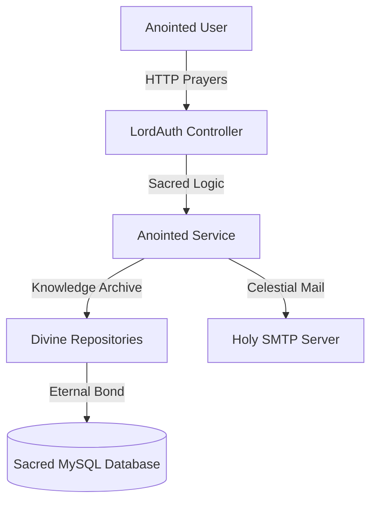

# LordAuth: The Anointed Email-OTP Authentication System

[](https://github.com/Lordradeez)
[](https://www.oracle.com/java/)
[](https://spring.io/projects/spring-boot)
[](LICENSE)

**LordAuth** is a divine, robust, and secure **Email-OTP Authentication System** meticulously crafted by **Anointed: Lordradeez**. This system provides a sacred two-step verification process, ensuring that only users with the correct 6-digit OTP delivered via email can access the sanctified dashboard.

---

## Application Preview

<p align="center">
  
  
</p>

---

## Celestial Features

- **Identity Consecration**: Seamless user registration into the LordAuth registry.
- **Anointed Access**: Secure login workflow integrated with OTP verification.
- **Eternal Validation**: Real-time OTP delivery using celestial SMTP protocols.
- **Sacred Expiring Tokens**: 1-minute OTP validity for supreme security.
- **Divine Persistence**: Reliable state management using MySQL.

---

## Celestial Architecture



---

## Consecration & Setup

### 1. Sacred Database
```sql
CREATE DATABASE lordauth_db;
```

### 2. Divine Properties
Update `src/main/resources/application.properties`:
```properties
server.port=9091
spring.datasource.url=jdbc:mysql://localhost:3306/lordauth_db
spring.mail.username=your_anointed_email@gmail.com
```

### 3. Build and Run
```bash
mvn clean install
mvn spring-boot:run
```

Access the application at `http://localhost:9091`

---

## License

This project is open source and available under the [MIT License](LICENSE).

---

## Anointed Creator

**Anointed: Lordradeez**
*The vision behind LordAuth.*

GitHub: [lordradez23](https://github.com/lordradez23)

---
*Blessed and secure authentication for the modern era.*
